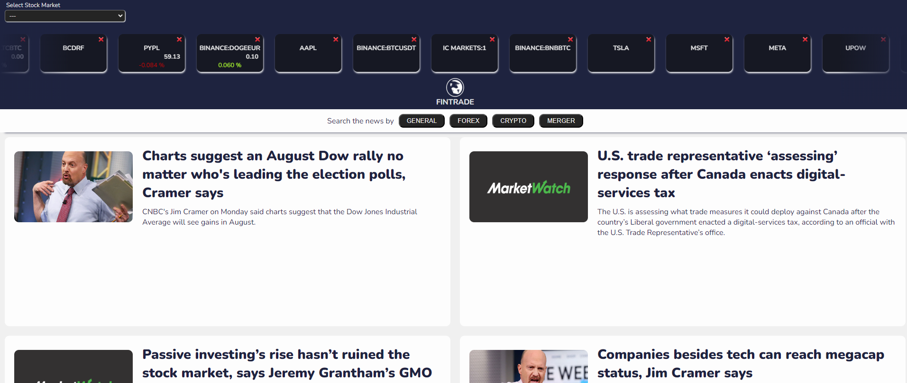

# FINTRADE

Table of Contents

1. [Overview](#overview)
2. [Prerequisites](#prerrequisites)
3. [Installation](#installation)
4. [Usage](#usage)
5. [Features](#features)
6. [Contact](#contact)

<a name='overview'></a>

## Overview

Fintrade is a JavaScript Vanilla application that utilizes both WebSockets and Fetch API to make real-time and historical stock market data requests from the Finnhub API (https://finnhub.io/). It provides a user-friendly interface for monitoring stock prices and trends.

<a name='prerrequisites'></a>

## Prerequisites

To run Fintrade, you'll need the following:

A web browser (Chrome, Firefox, Edge, etc.)
Basic understanding of HTML, CSS, JavaScript and Websocket
A Finnhub API account (https://finnhub.io/login)

<a name='installation'></a>

### Installation

Clone the Repository:

Clone the Fintrade repository from GitHub:

```Bash
git clone https://github.com/JCBalabuch/Fintrade
```

### Install Dependencies:

Navigate into the cloned directory and install the required dependencies:

```Bash
    npm install
```

### Usage

Obtain Finnhub API Key: Create a Finnhub API account and obtain your API key.

### Set API Key:

Open one .env file and set VITE_API_KEY placeholder with your actual API key and include the API url as VITE_URL_FETCH=https://finnhub.io/api/v1/.

## Start the Application:

Run the following command to start the Fintrade application:

```Bash
    npm start
```

This will launch a web server and open the application in your default browser.

<a name='usage'></a>

## Usage

<a name='features'></a>

## Features

Real-time Stock Price Updates: Receive live stock price updates via WebSockets.
Real-time Finnhub News: Receive live news updates via fetch.
User-friendly Interface: Easily monitor stock prices and trends with a clear and intuitive interface.
Customizable Stock Selection: Choose specific stocks to track and receive updates for.



<a name='contact'></a>

## Contact

For any questions, suggestions, or bug reports, please feel free to contact me at [Jeniffer Balabuch -mail](balabuchj@gmail.com) or in my linkedin [Jeniffer Balabuch - linkedin](https://www.linkedin.com/in/jenifferbalabuch/)
